# 🚗💨 Locadora de Veículos VL:  Sistema de Gestão de Locações

## 🌟 Equipe de Desenvolvimento

Uma equipe dedicada a transformar o controle de locações da VL!

*   **Bruno Basso** ➔ 22.123.067-5
*   **Gabriel Balbine** ➔ 22.222.001-4
*   **Gabriela Ciocci** ➔ 22.222.032-9
*   **Guilherme Albuquerque** ➔ 22.224.024-4

---

## 📖 Sobre o Projeto

A Locadora de Veículos VL, uma empresa regional em crescimento, nos contratou para modernizar sua gestão!  Atualmente, a VL opera com processos manuais e registros em fichas.  Nosso desafio é criar um sistema que automatize e otimize todas as etapas da locação de veículos.

## 🎯 Objetivo

Desenvolver um sistema completo para a Locadora VL, abrangendo:

*   ✅ **Modelagem de Software:**  Utilizando as melhores práticas para criar uma base sólida.
*   🗺️ **Diagrama de Caso de Uso:**  Visualizando as interações entre usuários e o sistema.
*   ⚙️ **Requisitos Funcionais e Não Funcionais:**  Garantindo que o sistema atenda a todas as necessidades da VL.
*   👥 **Atores:**  Identificando quem interage com o sistema (clientes, funcionários, etc.).

## 🚀 Diagrama de Casos de Uso

Este diagrama mostra as principais funcionalidades do sistema e como os diferentes atores interagem com ele:

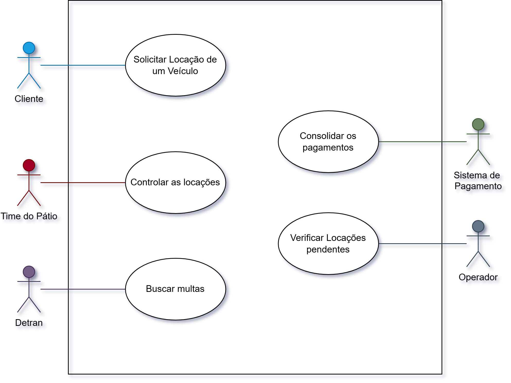

## 📝 Casos de Uso Detalhados

Abaixo, detalhamos cada caso de uso, mostrando o fluxo principal, fluxos alternativos, pré-condições e pós-condições.

### UC_01 - Solicitação de um Veículo

Clique para expandir

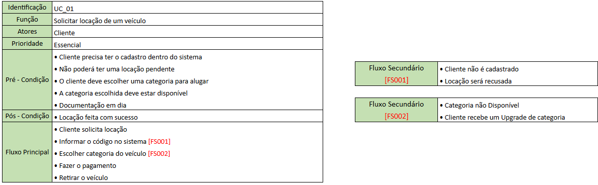

### UC_02 - Controlar as Locações

Clique para expandir

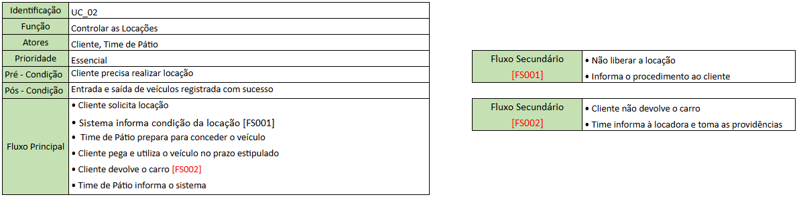

### UC_03 - Buscar Multas

Clique para expandir

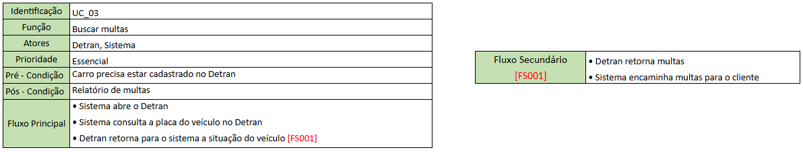

### UC_04 - Verificar Locações Pendentes

Clique para expandir

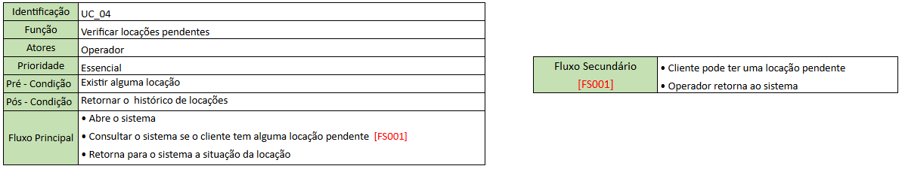

### UC_05 - Consolidar os Pagamentos

Clique para expandir

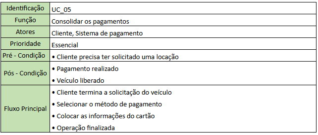

---

## 🧮 Diagrama de Classes

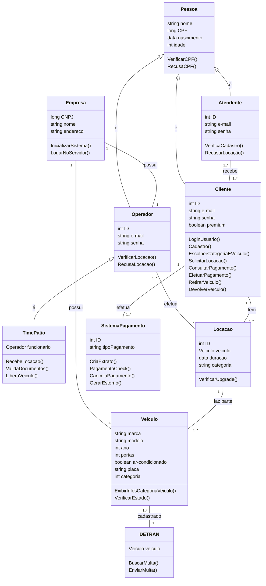

---

## 📌 Diagrama de Sequência

1. Solicitação de um Veículo
2. Controle das Locações
3. Buscar Multas
4. Consolidar Pagamentos
5. Consolidar Pagamentos

### 1️⃣ Solicitação de um Veículo
Este diagrama ilustra o processo de login, escolha de veículo, solicitação de locação, pagamento e retirada do veículo pelo cliente.

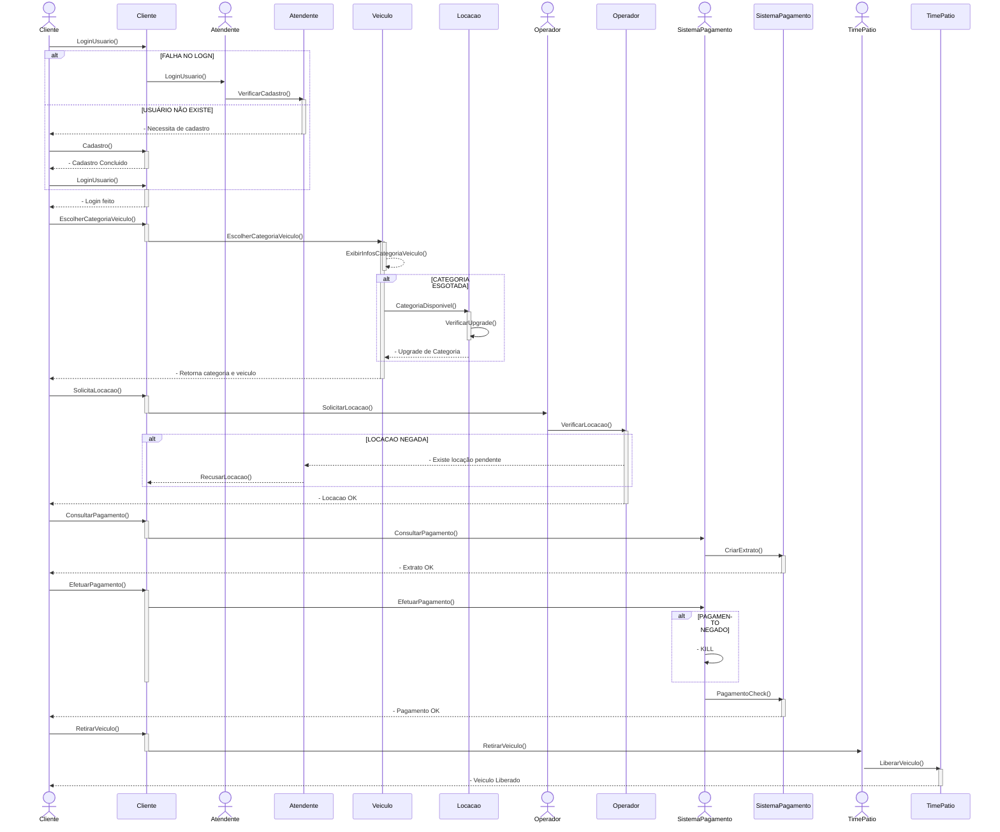

### 2️⃣ Controle das Locações
Este diagrama ilustra o fluxo de liberação e devolução de um veículo alugado.

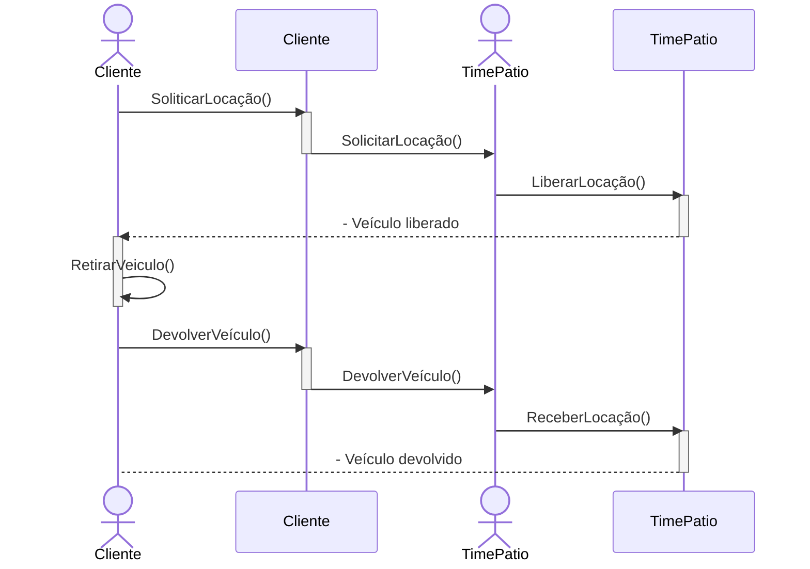

### 3️⃣ Buscar Multas
O diagrama abaixo representa o processo de busca de multas associadas ao veículo alugado.

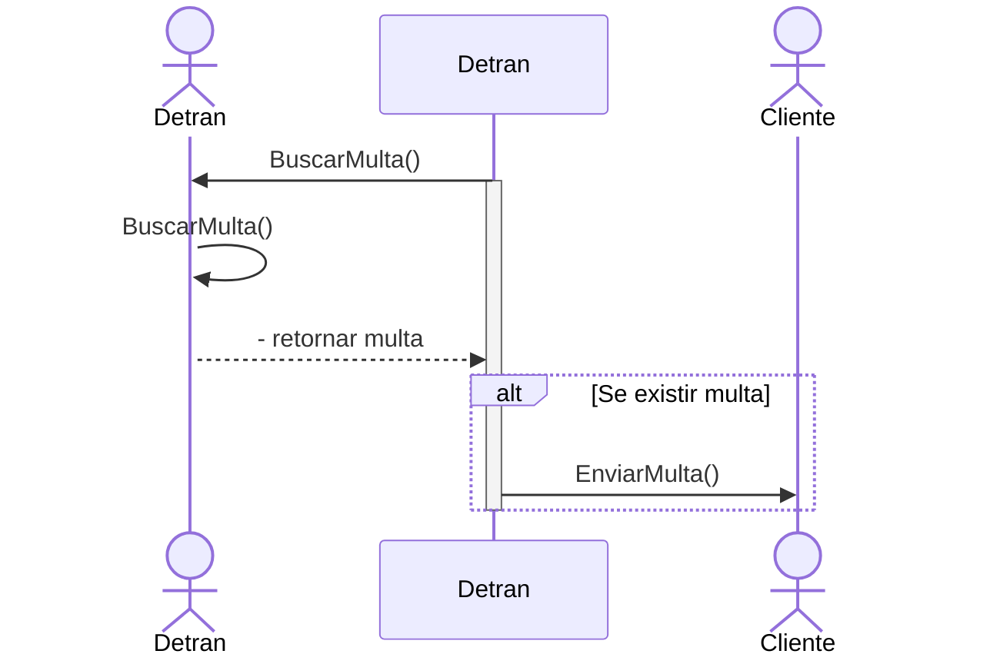
### 4️⃣ Verificar Locações Pendentes
O diagrama detalha a parte de verificação de uma locação do cliente.

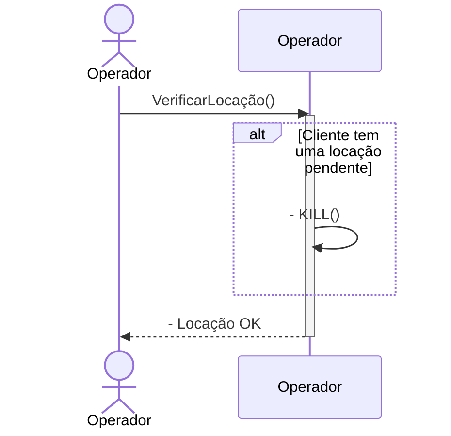

### 5️⃣ Consolidar Pagamentos
Este diagrama detalha como os pagamentos são processados e confirmados para o cliente.

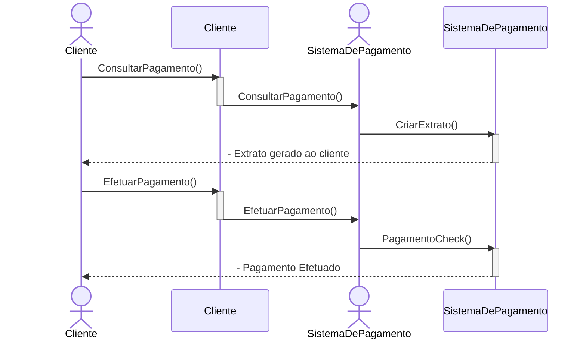

---
## 📈 Diagrama de Sequência

### 1️⃣ Cliente
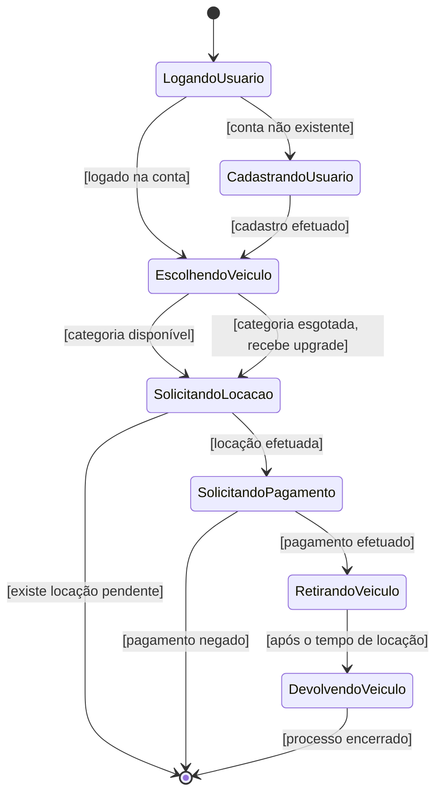
### 2️⃣ Detran

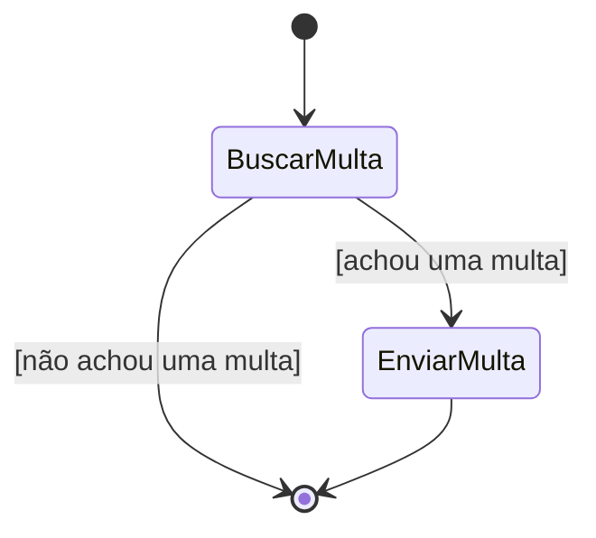
### 3️⃣ SistemaPagamento

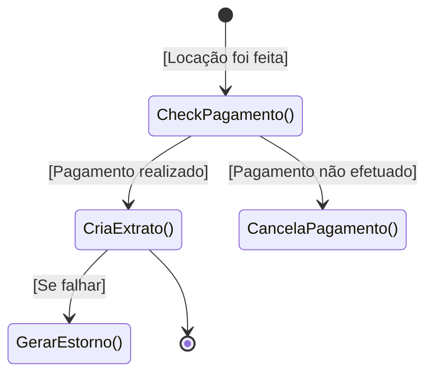

### 4️⃣ Veículo

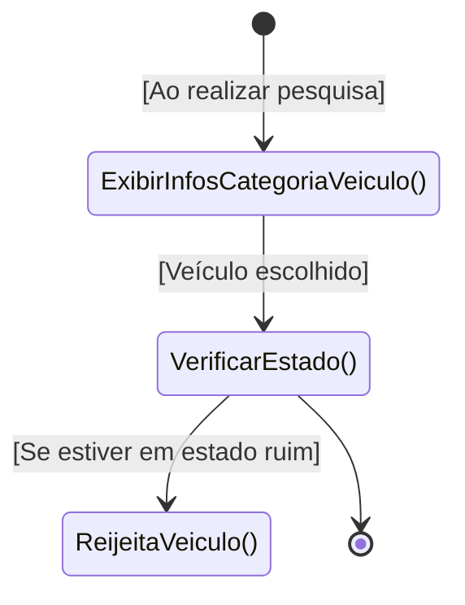

### 5️⃣ Pessoa

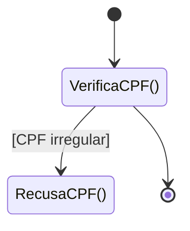
### 6️⃣ Operador

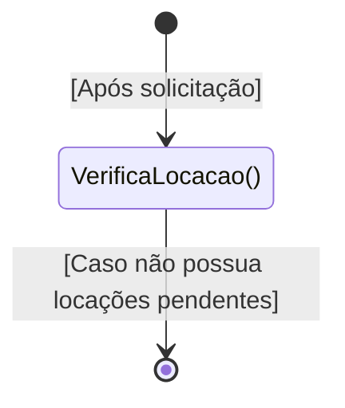

### 7️⃣ TimePatio

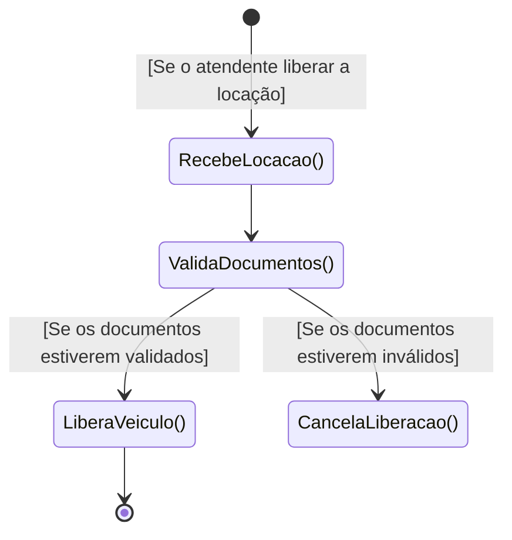

---

## 🛠️ Tecnologias

*   **Diagramas:** 
*   **Diagramas de Caso de Uso:** 
*   **Diagramas de Classes:** 
*   **Diagrama de Sequência:** 

---

## 🤝 Contribuições
Contribuições para aprimorar este projeto são muito bem-vindas, forke o projeto e contribua!

## ✉️ Contato
Qualquer dúvida sobre o projeto entrar em contato, será um prazer!
