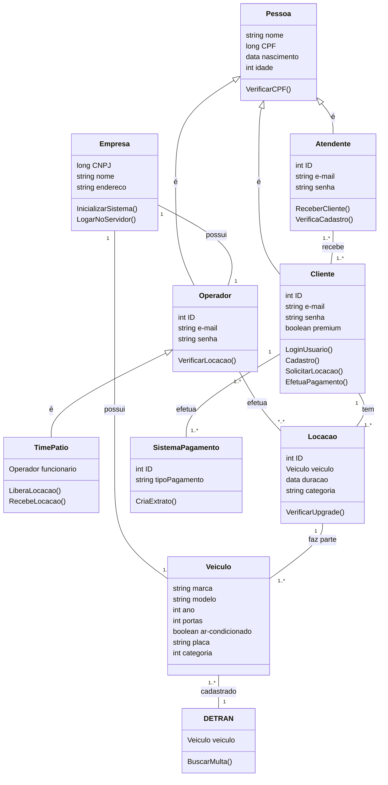

# 🚗💨 Locadora de Veículos VL:  Sistema de Gestão de Locações

## 🌟 Equipe de Desenvolvimento

Uma equipe dedicada a transformar o controle de locações da VL!

*   **Bruno Basso** ➔ 22.123.067-5
*   **Gabriel Balbine** ➔ 22.222.001-4
*   **Gabriela Ciocci** ➔ 22.222.032-9
*   **Guilherme Albuquerque** ➔ 22.224.024-4

---

## 📖 Sobre o Projeto

A Locadora de Veículos VL, uma empresa regional em crescimento, nos contratou para modernizar sua gestão!  Atualmente, a VL opera com processos manuais e registros em fichas.  Nosso desafio é criar um sistema que automatize e otimize todas as etapas da locação de veículos.

## 🎯 Objetivo

Desenvolver um sistema completo para a Locadora VL, abrangendo:

*   ✅ **Modelagem de Software:**  Utilizando as melhores práticas para criar uma base sólida.
*   🗺️ **Diagrama de Caso de Uso:**  Visualizando as interações entre usuários e o sistema.
*   ⚙️ **Requisitos Funcionais e Não Funcionais:**  Garantindo que o sistema atenda a todas as necessidades da VL.
*   👥 **Atores:**  Identificando quem interage com o sistema (clientes, funcionários, etc.).

## 🚀 Diagrama de Casos de Uso

Este diagrama mostra as principais funcionalidades do sistema e como os diferentes atores interagem com ele:

## 📝 Casos de Uso Detalhados

Abaixo, detalhamos cada caso de uso, mostrando o fluxo principal, fluxos alternativos, pré-condições e pós-condições.

### UC_01 - Solicitação de um Veículo

Clique para expandir

### UC_02 - Controlar as Locações

Clique para expandir

### UC_03 - Buscar Multas

Clique para expandir

### UC_04 - Verificar Locações Pendentes

Clique para expandir

### UC_05 - Consolidar os Pagamentos

Clique para expandir

---

## <> Diagrama de Classes

---

## 🛠️ Tecnologias

*   **Diagramas:** [draw.io](http://draw.io)
*   **Diagramas de Caso de Uso:** 
*   **Diagramas de Classes:** [mermaid.live](https://mermaid.live/)

## 🤝 Contribuições
Contribuições para aprimorar este projeto são muito bem-vindas, forke o projeto e contribua!

## ✉️ Contato
Qualquer dúvida sobre o projeto entrar em contato, será um prazer!
